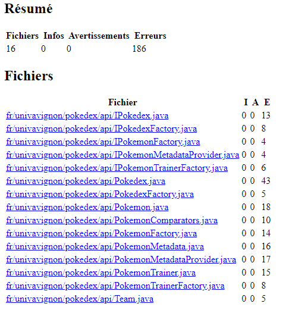
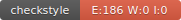
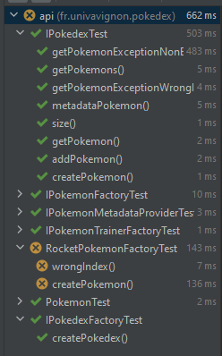

# UCE Génie Logiciel Avancé : Techniques de tests
# Rapport 1 - OPIGEZ Jérémie

## Introduction

Dans cet UE, le projet consiste à mettre en place un outil d’analyse statistique pour le jeu Pokémon GO.  
Pour cela nous devons mettre en place l'ensemble des tests depuis les interfaces avant d'effectuer toutes implementations.
Ce projet permet aussi d'assimiler de bons reflexes dans la gestion du code.

## 4eme partie: 100% IV
Cette partie nous permet d'aborder deux nouveaux outils.
Codecov nous permet d'avoir un indicateur de pertinence de nos tests en nous donnant le poucentage de couverture que nos
tests réalisent. Le Code Coverage nous permet aussi de relever du code mort.

La réalisation de badges permet d'afficher des informations rapidement lié au CI.
### Badge Codecov

### Badge CircleCI

Nous entrons ensuite dans l'implémentation des classes auquel nous avions implémenté les tests dans la partie précédente.
L'objectif étant de pouvoir passer ces tests le plus rapidement possible. Une fois cela fait, on refactor le code.

## 5eme partie: Bulbapedia
Dans cette partie nous abordons un outil permettant de faire un compte rendu sur la qualité du code et la generation,
ainsi que l'hebergement de la documentation du code.

La qualité du code se fait via l'outil checkstyle qui une fois intégré dans le processus d'integration continue,
permet de donner un compte rendu de la qualité de notre code.

### Badge Checkstyle

Ensuite vient la generation de la javadoc du git dans le processus integration continue.
Cette javadoc peut être directement hébergé sur github.
https://jeremie-op.github.io/ceri-m1-techniques-de-test/fr/univavignon/pokedex/api/package-summary.html

## 6eme partie: Ils sont de retour pour vous jouer un mauvais tour
"Prepare for trouble! And make it double!" 
Cette partie consiste à utiliser l'implémentation founise sur nos tests. La Team Rocket étant malicieuse, son but est de reussir
à montrer que nos tests ne sont pas suffisament bien pensé pour tous les cas de figures.
Si ce n'est un souci vis-à-vis du PokemonMetadataProvider qui est utilisé dans mon implementation et pas dans celle de la Team Rocket
je n'ai pas relevé de problème sur mes tests qui ont révélés les méfaits de la Team Rocket (une implémentation qui ne répond pas au specifications).

